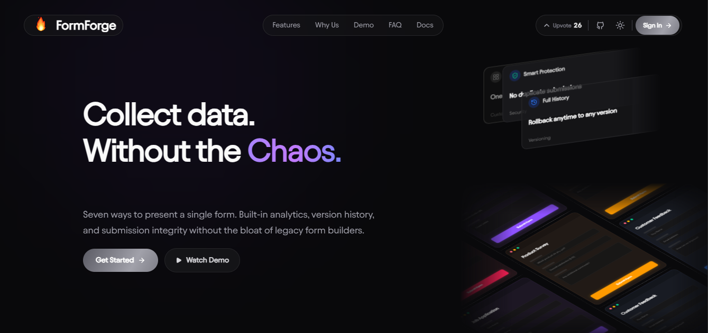
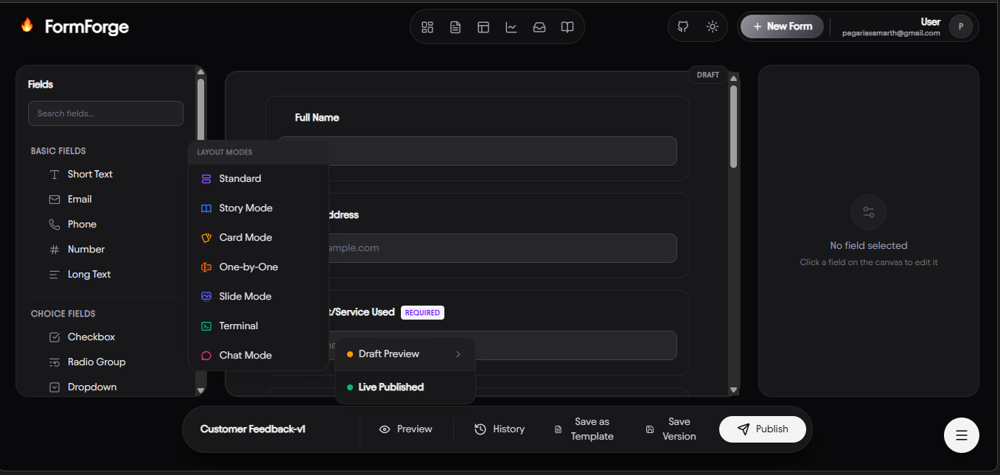
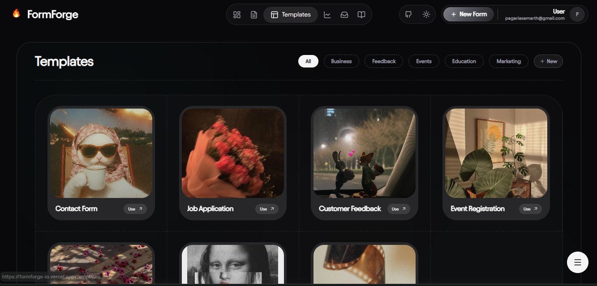

# 🚀 FormForge

[](https://nextjs.org)
[](https://www.typescriptlang.org)
[](https://trpc.io)
[](https://supabase.com)
[](https://vercel.com)
[](https://turbo.build)

## PROJECT CONTEXT
**Project Name:** FormForge  
**Type:** Modern form-building platform with AI capabilities  
**Architecture:** Turborepo monorepo with Next.js 16+ (App Router), TypeScript, tRPC for type-safe APIs, Drizzle ORM + Supabase for auth/database, Vercel for hosting.  
**Core Concept:** Schema-driven form builder with GitHub integration, multi-agent AI assistance, and comprehensive embedded documentation.



---

## 1. PROJECT IDENTITY
- **Exact Project Name:** FormForge
- **One-line Tagline:** Modern form-building platform with AI capabilities.
- **Project Overview:** FormForge is an advanced, schema-driven form-building platform that leverages the modern React ecosystem. By combining Next.js App Router, tRPC, and Drizzle ORM within a Turborepo monorepo, FormForge guarantees strict end-to-end type safety while simplifying the process of generating, validating, and submitting complex forms.
- **Value Proposition:** FormForge uniquely unifies schema-driven configurations with multi-agent AI assistance and GitHub repository management, enabling developers to build, test, and sync robust forms faster than traditional UI-based form builders.
- **Current Development Phase:** Rapid active development on a unified, type-safe monorepo architecture.

---

## 2. COMPLETE TECH STACK WITH VERSIONS

#### Turborepo Monorepo Structure
- **Turborepo Version:** `2.9.18`
- **Package Manager:** `pnpm@9.0.0`
- **Workspace Structure:**
  ```text
  apps/
    └── web/                # Next.js 16 frontend & API application
  packages/
    ├── ui/                 # Shared UI components (shadcn/ui + tailwindcss 4.3.1)
    ├── config/             # Shared ESLint/TypeScript configs
    ├── db/                 # Database schema and utilities (Drizzle ORM)
    ├── form-engine/        # Core form rendering and logic
    └── validators/         # Shared Zod schemas
  ```

#### Dependencies (from `apps/web/package.json` & `packages/db/package.json`)

| Package | Version | Purpose | Usage |
|---------|---------|---------|--------|
| Next.js | `16.2.0` | React framework (App Router) | Full-stack app, server components (`apps/web`) |
| React | `19.2.0` | UI Library | Frontend rendering |
| tRPC | `11.17.0` | Type-safe API layer | End-to-end type safety between client/server |
| Supabase Auth | `2.108.2` | Authentication | `@supabase/ssr` for Next.js App Router auth integration |
| Drizzle ORM | `0.45.2` | Database ORM | Schema definition and querying in `packages/db` |
| Zod | `4.4.3` | Schema validation | Form validation, API validation |
| TypeScript | `5.9.2` | Type safety | Full type coverage across the monorepo |
| Tailwind CSS | `4.3.1` | Styling | Utility-first CSS framework |

---

## 3. COMPLETE DEPLOYMENT STACK

#### Vercel Deployment
- **Platform:** Vercel (frontend and API hosting)
- **Deployment Method:** GitHub integration (automatic deploys on main branch)
- **Build Command:** `turbo run build`
- **Output Directory:** `.next` inside `apps/web`
- **Environment Variables:** Managed natively in the Vercel dashboard.
- **Preview Deployments:** Automatic generation for all pull requests.

#### Supabase Configuration
- **Auth Configuration:**
  - Employs `@supabase/ssr` for cookie-based session management in App Router.
  - Integration across middleware and server-side components.
- **Database:**
  - PostgreSQL managed by Supabase, interacted with using **Drizzle ORM** (`postgres` driver `^3.4.9`).

---

## 4. CRONJOB / KEEP-ALIVE CONFIGURATION

**Health Check Endpoint:**
```typescript
// apps/web/app/api/health/route.ts
GET /api/health
```
- **Description:** Basic health check for uptime monitoring.
- **Usage:** Used by external uptime monitors to ping the Vercel serverless functions regularly, keeping them warm to avoid cold starts.
- **Auth Required:** No

---

## 5. SUPABASE & DATABASE INTEGRATION DEEP DIVE

#### Authentication Flow
- FormForge uses `@supabase/ssr` for robust authentication in the Next.js App Router ecosystem.
- Session handling is integrated directly into Next.js middleware to protect private routes securely.


#### Database Schema (Drizzle ORM)
Instead of raw SQL or standard Supabase client models, the project uses **Drizzle ORM** within `packages/db`:
- Managed via `drizzle-kit` (`^0.31.10`)
- Pushed to the database using `pnpm db:push`
- Schema and relations are strongly typed and shared across the monorepo.

---

## 6. TRPC IMPLEMENTATION

- **Version:** tRPC `11.17.0`
- **Router Structure:** Uses `@trpc/server` and `@trpc/react-query` to build type-safe API procedures.
- **Configuration:** Procedures defined in `apps/web/src/trpc/init.ts` ensuring tight typing with Zod validators from `packages/validators`.

---

## 7. NEXT.JS ARCHITECTURE

- **App Router:** Fully embraces Next.js 16 App Router.
- **Structure:**
  ```text
  apps/web/
  ├── app/
  │   ├── (auth)/          # Authentication routes (sign-in, sign-up)
  │   ├── (dashboard)/     # Protected application dashboard
  │   ├── api/             # Route handlers (trpc, health)
  │   └── layout.tsx       # Root layout
  ├── components/          # React components
  ├── lib/                 # Supabase clients & utilities
  └── src/trpc/            # tRPC setup and routers
  ```
- **Middleware:** `apps/web/middleware.ts` handles Supabase session checking and route protection.

---

## 8. GITHUB INTEGRATION

- **Features:** Connect GitHub repositories to manage and version form schemas directly.
- **Security Considerations:** GitHub tokens (if utilized) are managed on the client side with strict permissions warnings regarding repository write access.

---

## 9. SCALARDOCS / DOCUMENTATION

- **Embedded Documentation Sync:** A custom sync script keeps embedded documentation fresh.
- **Command:** `pnpm run sync-docs` invokes Python scripts (`scripts/sync-embedded-docs.py`) that sync markdown guides directly into application constants.

---

## 10. FEATURES INVENTORY

- **Schema-Driven Forms:** Build complex forms from JSON or Zod schemas dynamically.
- **Type Safety:** Full TypeScript support with automatic inference across the Turborepo stack.
- **Workspace Monorepo:** Split components natively using `@formforge/ui`, `@formforge/db`, and `@formforge/validators`.
- **Modern UI:** Styled using Tailwind CSS v4, shadcn/ui, and Framer Motion.



---

## 11. API ENDPOINTS

- **`GET /api/health`**: Service availability health check.
- **`POST /api/trpc/*`**: Unified endpoint handling all tRPC queries and mutations automatically generated by the tRPC router.

---

## 12. ENVIRONMENT VARIABLES

```bash
# ⚠️ IMPORTANT: DO NOT EXPOSE REAL KEYS

# Database (Drizzle ORM)
DATABASE_URL=postgres://...

# App URL
NEXT_PUBLIC_APP_URL=http://localhost:3000

# Resend (Emails)
RESEND_API_KEY=
RESEND_FROM=FormForge <onboarding@resend.dev>

# (Legacy variables for Clerk may be present in .env.example, but Supabase is used in the current package tree)
```

---

## 13. PROJECT STRUCTURE MAP

```text
formforge/
├── apps/
│   └── web/                          # Next.js 16 frontend & API
│       ├── app/                      # App Router pages
│       ├── components/               # React components
│       ├── lib/                      # Supabase client instantiation
│       └── src/trpc/                 # tRPC configuration
├── packages/
│   ├── db/                           # Drizzle ORM schemas & migrations
│   ├── form-engine/                  # Core parsing and rendering logic
│   ├── ui/                           # Shared UI components (shadcn)
│   ├── validators/                   # Shared validation logic (Zod)
│   ├── eslint-config/                # Linting rules
│   └── typescript-config/            # TS rules
├── turbo.json                        # Turborepo caching configs
└── package.json                      # Monorepo scripts
```

---

## 14. SCRIPTS FROM package.json

**Root `package.json`:**
```json
{
  "build": "turbo run build",
  "dev": "turbo run dev",
  "lint": "turbo run lint",
  "format": "prettier --write \"**/*.{ts,tsx,md}\"",
  "check-types": "turbo run check-types",
  "sync-docs": "python scripts/sync-embedded-docs.py"
}
```

**`apps/web/package.json`:**
```json
{
  "dev": "next dev --port 3000",
  "build": "next build",
  "start": "next start",
  "lint": "eslint --max-warnings 0",
  "check-types": "next typegen && tsc --noEmit"
}
```

---

## 15. DEPLOYMENT DETAILS

- **Frontend & Serverless APIs:** Hosted on **Vercel**. Integrates deeply with Turborepo caching to ensure highly optimized build times.
- **Database:** Hosted on **Supabase (PostgreSQL)**, mapped directly using Drizzle ORM pushing schemas.

---

## 16. LIMITATIONS & KNOWN ISSUES

- **Serverless Cold Starts:** Vercel serverless API routes may suffer from initial cold starts, mitigated partially by keep-alive cronjobs.
- **Supabase Realtime:** Realtime subscriptions are not fully integrated for form live-updates by default.
- **Monorepo Build Caching:** If Vercel Remote Cache is not enabled, local CI build times might increase over time.

---

## 17. SECURITY & GUARDRAILS

- **Input Validation:** Enforced globally via `zod` at the tRPC boundary.
- **Auth Guarding:** Server-side component auth verification using `@supabase/ssr` inside Next.js middleware.
- **Type Safety:** Full end-to-end TS coverage heavily reduces runtime errors.

---

## 18. UI/UX DOCUMENTATION

- **Styling framework:** Tailwind CSS 4.3.1
- **Component Library:** Built iteratively utilizing custom `shadcn` implementations (`@repo/ui`).
- **Animations:** Employs `framer-motion` for fluid component transitions and micro-interactions.
- **Icons:** A blend of `@tabler/icons-react`, `lucide-react`, and `@untitledui/icons` provides extensive iconography.


